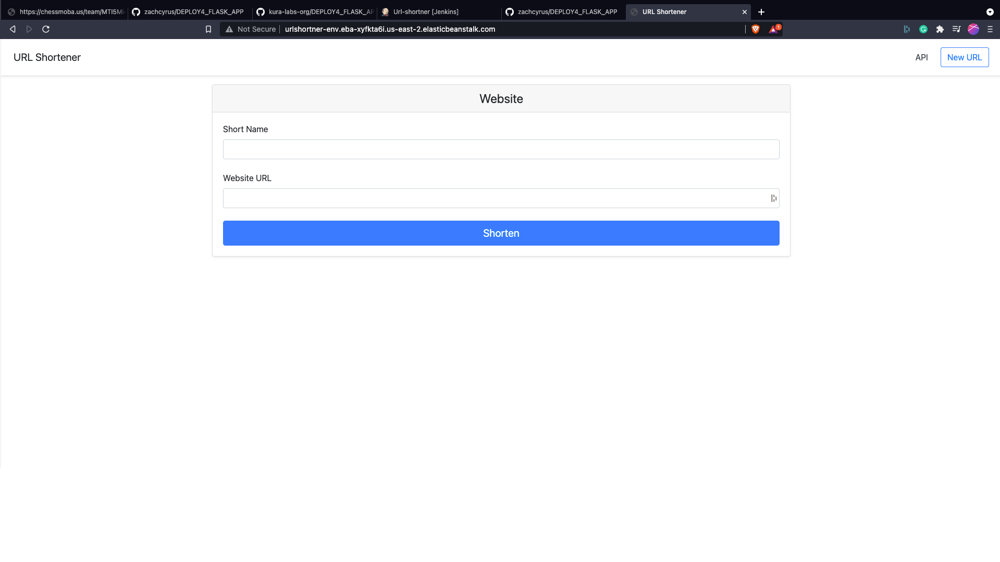
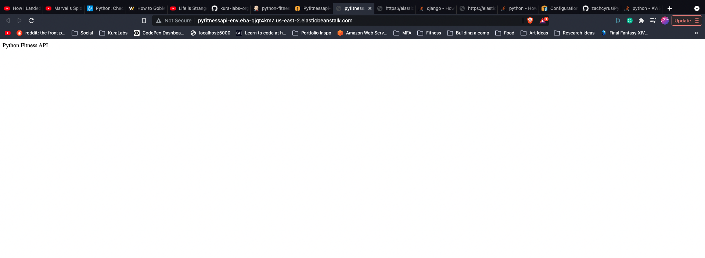

# Documentation for Deployment 4

## Goals:

Deploying three different python flask applications to AWS elastic beanstalk through a Jenkins pipeline.

## Links and Screenshots to Application Repos

- Url shortner application is in this repo
    

- [Todo App](https://github.com/zachcyrus/todo-list)
    

- [Python Fitness API](https://github.com/zachcyrus/Python-Fitness-API/tree/deployment)
    